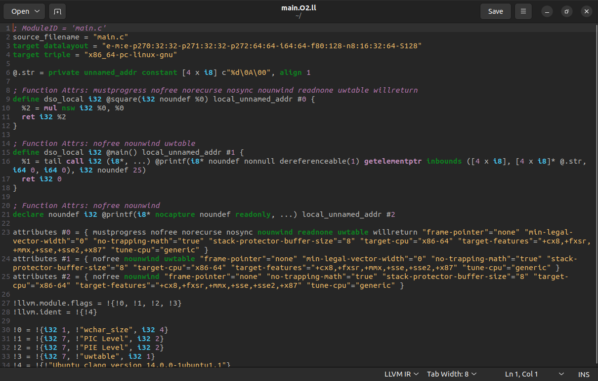

# Преобразование и анализ кода с использованием Clang и LLVM

## Постановка задачи:

**Цель:** познакомиться с инструментами Clang и LLVM, научиться собирать AST и IR-промежуточное представление кода на C/C++, а также извлекать базовую информацию о программе (например, список функций).

**Задачи:**
- Установить Clang и LLVM;
- Скомпилировать простой C-файл с использованием clang и получить его: абстрактное синтаксическое дерево (AST), промежуточное представление LLVM IR;
- Использовать opt для применения базовой комплексной оптимизации (например, О2);
- Построить граф потока управления (CFG) для оптимизированной программы;
- Проанализировать результат, сделать выводы и ответить на контрольные вопросы.

## Ход работы

### 1. Установка и подготовка среды

Работа выполнялась в среде **Ubuntu 22.04**. Установлены следующие инструменты:

- `clang` — компилятор языка C/C++.
- `llvm` — инструменты анализа и оптимизации кода.
- `opt` — инструмент для работы с LLVM IR и применения оптимизаций.
- `Graphviz` — инструмент для визуализации кода.

Команда установки: 
```bash
sudo apt install clang llvm
```

 

### 2. Исходный код

Программа на языке C:
```c
#include <stdio.h>
int square(int x) {
    return x * x;
}
int main() {
    int a = 5;
    int b = square(a);
    printf("%d\n", b);
    return 0;
}
```
Сохранена в файл main.c.

### 3. Получение AST

Команда для генерации AST:
```bash
clang -Xclang -ast-dump -fsyntax-only main.c
```


Функция `square` принята, содержит параметр x и возвращает `x * x`.

### 4. Генерация LLVM IR

Команда для генерации LLVM IR:
```bash
clang -S -emit-llvm main.c -o main.ll
```


### 5. Оптимизация IR

Команда для генерации неоптимизированного IR:
```bash
clang -O0 -S -emit-llvm main.c -o main_O0.ll
```

Стоит отметить, что в файле с IR до оптимизации:
- Все переменные (a, b, x.addr) размещены в памяти через alloca;
- Множество операций `load` и `store`;
- `square` вызывается как отдельная функция.


Команда для генерации оптимизированного IR с уровнем `-O2`:
```bash
clang -O2 -S -emit-llvm main.c -o main_O2.ll
```

Команда `-O2` – комплексная оптимизация среднего уровня. Она применяет более 30 различных оптимизаций:
- `-inline` – встраивание небольших функций (встраивает `square` в `main`, если она вызывается один раз);
- `-constprop` – подставит значение `square(5) → 25`, если функция встроена и всё известно на этапе компиляции;
- `-mem2reg` – перевод переменных из памяти в регистры (SSA);
- `-instcombine` – объединение и упрощение инструкций (упростит арифметику, например `x * x` может быть преобразовано в `shl` при `x = 2^n`);
- `-simplifycfg` – оптимизирует структуру блоков (упростит граф управления, если после `inlining` останутся лишние блоки);
- `-reassociate`, `-gvn`, `-sroa`, `-dce` и другие.



Команда для сравнения IR до и после оптимизации:
```bash
diff main_O0.ll main_O2.ll
```


Стоит отметить, что после оптимизации произошли следующие изменения:
- Переменные типа `alloca` были удалены;
- Код переведён в SSA-форму;
- Оптимизация улучшила читаемость и упростила поток управления.

### 6. Граф потока управления программы

Команда для генерации оптимизированного LLVM IR:
```bash
clang -O2 -S -emit-llvm main.c -o main.ll
```

Команда для генерации `.dot`-файлов CFG для функций:
```bash
 opt -dot-cfg -disable-output main.ll
```


Команда для установки библиотеки `Graphviz`: 
```bash
sudo apt install graphviz
```

Команды для преобразования файлов с расширением `.dot` в `.png` с помощью `Graphviz`:
```bash
dot -Tpng .main.dot -o cfg_main.png
dot -Tpng .square.dot -o cfg_square.png
```
Команды для просмотра файлов с CGF:
`xdg-open cfg_main.png`


Стоит отметить, что в LLVM каждый граф потока управления (CFG) строится на уровне функции, поскольку структура управления всегда локальна для тела функции. Для получения полного представления о программе, нужно построить CFG для всех функций и анализировать их совокупность. Автоматическое объединение всех CFG в один граф не предусмотрено в LLVM по умолчанию.

### 7. Ответы на контрольные вопросы

1. Clang — это фронтенд-компилятор для языков C, C++, Objective-C и других. Его задача — парсить исходный код, строить абстрактное синтаксическое дерево (AST) и превращать его в промежуточное представление LLVM IR. Clang — часть инфраструктуры LLVM и служит первым этапом компиляции.

2. LLVM — это модульная компиляторная инфраструктура, включающая инструменты и библиотеки для анализа, оптимизации и генерации кода. Она используется как основа для создания компиляторов, где Clang генерирует LLVM IR, а остальные компоненты LLVM занимаются оптимизацией и генерацией машинного кода под разные архитектуры.

3. AST — это структурированное дерево, отражающее синтаксис исходного языка. Оно сохраняет семантику и структуру кода высокого уровня.
LLVM IR — низкоуровневое представление, ближе к машинному коду, предназначено для оптимизации и трансформации. AST нужен для анализа на этапе фронтенда, IR — для последующей генерации и оптимизации кода.

4. IR — это универсальный формат, который упрощает анализ, оптимизацию и трансляцию кода. Он абстрагирует конкретные языки и аппаратные архитектуры, позволяя применять одни и те же оптимизации к разным языкам и платформам.

5. `alloca` выделяет память на стеке внутри функции. Обычно используется для создания локальных переменных. Память автоматически освобождается при выходе из функции. Это аналог `int x`; в C, но на уровне IR.

6. Оптимизация повышает производительность, уменьшает размер кода, снижает энергопотребление. Основные цели:
- Устранение избыточных операций
- Упрощение вычислений
- Повышение локальности данных
- Улучшение использования регистров и памяти

7. SSA (Static Single Assignment) — форма представления кода, где каждая переменная присваивается один раз. Новое присваивание = новая версия переменной. Это упрощает анализ зависимостей и позволяет применять мощные оптимизации (например, устранение мёртвого кода, постоянное свёртывание).

8. CFG (Control Flow Graph) — это граф, где узлы — базовые блоки, а рёбра — переходы между ними. Он позволяет анализировать порядок выполнения, условия, циклы и т.д. CFG важен для оптимизаций, анализа живости переменных, построения SSA и выявления мёртвого кода.

9. Арифметические операции представлены инструкциями, каждая из которых действует на операнды:
- `add` — сложение
- `mul` — умножение
- `sub`, `sdiv`, `fadd`, и т.п.
Операнды имеют чётко указанный тип (`i32`, `float`, и т.д.). Пример:
```bash
%res = add i32 %a, %b
```

10. Функции — изолированные блоки с чёткими входами и выходами, что упрощает их анализ. Это позволяет:
- Применять оптимизации локально
- Инлайнить короткие функции
- Удалять неиспользуемые
- Строить CFG и SSA внутри каждой функции

11. Скорее всего, компилятор её инлайнит — вставляет тело функции прямо в место вызова. Это снижает накладные расходы на вызов функции и может улучшить производительность.

12. Исходный текст слишком вариативен и содержит много синтаксического шума. IR и CFG:
- Имеют строгую структуру
- Упрощают анализ зависимостей и потока управления
- Явно отображают все операции и переходы
- Упрощают реализацию универсальных и переносимых оптимизаций

## Выводы

- С помощью Clang можно получить полную структуру AST, IR и CFG.
- LLVM предоставляет гибкие инструменты анализа и оптимизации.
- Промежуточное представление (IR) удобно для написания компиляторных трансформаций.

## Дополнительное задание (Вариант 2): 

Определите структуру ```c struct Point { int x; int y; };```, инициализируй объект ```c Point p = {2, 3};```, вызовите функцию, принимающую ```c Point``` как аргумент. Проанализируйте представление структуры в IR и передачу по значению.

### Написание кода на C

Создадим файл `point.c` со следующим содержанием:

```c
#include <stdio.h>
struct Point {
    int x;
    int y;
};
void printPoint(struct Point p) {
    printf("Point: (%d, %d)\n", p.x, p.y);
}
int main() {
    struct Point p = {2, 3};
    printPoint(p);
    return 0;
}
```

### Генерация LLVM IR

Команда для генерации LLVM IR:
```bash
clang -S -emit-llvm point.c -o point.ll
```


### Анализ LLVM IR (point.ll)

Определение структуры в IR: 
```bash
%struct.Point = type { i32, i32 }
```

- Эквивалент ```c struct Point { int x; int y; }``` в C;
- i32 — 32-битное целое (аналог int в C).

Функция ```c printPoint```:
```bash
define void @printPoint(%struct.Point %p) {
entry:
  %p.addr = alloca %struct.Point, align 4
  store %struct.Point %p, %struct.Point* %p.addr, align 4
  %x = getelementptr inbounds %struct.Point, %struct.Point* %p.addr, i32 0, i32 0
  %0 = load i32, i32* %x, align 4
  %y = getelementptr inbounds %struct.Point, %struct.Point* %p.addr, i32 0, i32 1
  %1 = load i32, i32* %y, align 4
  %call = call i32 (i8*, ...) @printf(i8* getelementptr inbounds ([16 x i8], [16 x i8]* @.str, i32 0, i32 0), i32 %0, i32 %1)
  ret void
}
```

- `%struct.Point %p` — параметр передается по значению (копируется вся структура);
- `alloca %struct.Point` — выделение памяти в стеке для локальной копии структуры;
- `getelementptr` — вычисление адресов полей `x` и `y`:
      - i32 0, i32 0 — обращение к первому полю (`x`);
      - i32 0, i32 1 — обращение ко второму полю (`y`)
- `call @printf` — вызов функции с передачей значений полей.

Функция ```c main```:
```bash
define i32 @main() {
entry:
  %p = alloca %struct.Point, align 4
  %0 = getelementptr inbounds %struct.Point, %struct.Point* %p, i32 0, i32 0
  store i32 2, i32* %0, align 4  ; p.x = 2
  %1 = getelementptr inbounds %struct.Point, %struct.Point* %p, i32 0, i32 1
  store i32 3, i32* %1, align 4  ; p.y = 3
  %2 = load %struct.Point, %struct.Point* %p, align 4
  call void @printPoint(%struct.Point %2)  ; Передача копии структуры
  ret i32 0
}
```

- `alloca %struct.Point` — выделение памяти для структуры p в стеке;
- `store i32 2, i32* %0` — инициализация поля `x`;
- `store i32 3, i32* %1` — инициализация поля `y`.
- `load %struct.Point` — загрузка всей структуры для передачи в ```c printPoint```.
